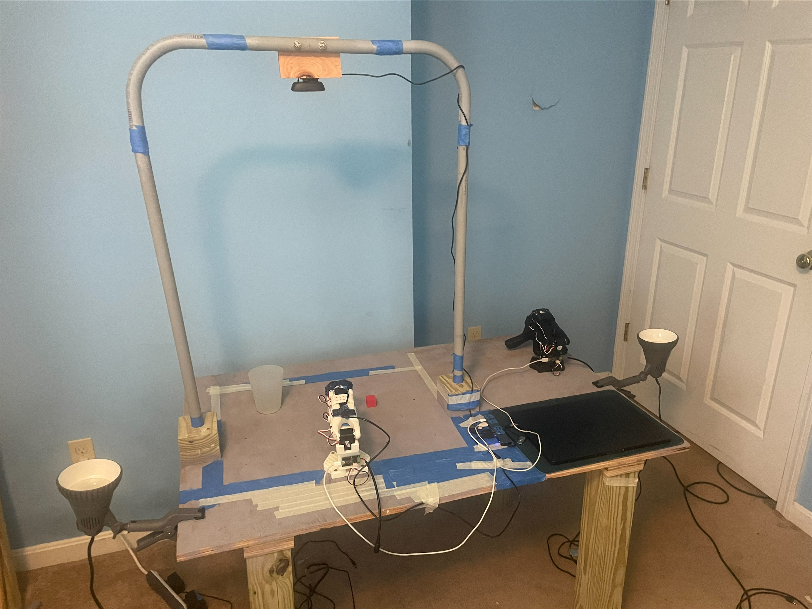

# Setup and Reproduction

## Environment

- **Data collection and inference:** macOS (MacBook Air).
- **Training:** cloud GPU (Google Colab, A100).
- Python 3.12 via Miniforge/conda.

```bash
conda create -n lerobot python=3.12
conda activate lerobot
pip install "lerobot[feetech,smolvla,dataset]"
pip install "pandas>=2.2" numpy scipy scikit-learn statsmodels matplotlib openpyxl
```

`pandas >= 2.2` is required. The analysis scripts use named aggregation and grouped
`quantile` behavior that changed in that release.

Every tool reads datasets from the local LeRobot cache. Override the default with
`LEROBOT_CACHE` if yours lives elsewhere:

```bash
export LEROBOT_CACHE="$HOME/.cache/huggingface/lerobot/<your-hf-username>"
```

The shell scripts under `scripts/` are written for macOS. They use AVFoundation camera
backends and Darwin device names, and `run_inference.sh` defaults to `--policy.device=mps`.
On Linux, override with `DEVICE=cuda` and see the notes in each script.

## Hardware bring-up (SO-ARM101)

Power: **leader = 5V, follower = 12V**.

1. **Find serial ports:** `lerobot-find-port`, once per arm. Note each port.
2. **Assign motor IDs:** `lerobot-setup-motors`, connecting one motor at a time.
3. **Calibrate each arm.** Clamp them down first, and replace `<follower_port>` and
   `<leader_port>` with your own ports from step 1.

```bash
lerobot-calibrate --robot.type=so101_follower --robot.port=<follower_port> --robot.id=my_follower_arm
lerobot-calibrate --teleop.type=so101_leader  --teleop.port=<leader_port>  --teleop.id=my_leader_arm
```

4. **Verify teleoperation and cameras:** `bash scripts/check_cameras_live.sh`

Ports, camera indices and the Hugging Face username can all be overridden by environment
variable rather than by editing the scripts:

```bash
export HF_USER=<your-hf-username>
export FOLLOWER_PORT=/dev/tty.usbmodemXXXX
export LEADER_PORT=/dev/tty.usbmodemYYYY
export OVERHEAD_IDX=1
export WRIST_IDX=0
```



## Cameras

Two USB cameras (overhead and wrist) on a hub. Current mapping: **overhead = index 1,
wrist = index 0**.

- **macOS caveat.** OpenCV camera indices shuffle between sessions, and **index 2 is the
  MacBook's own built in camera**, which must never be passed to LeRobot. Run
  `python tools/check_cameras.py` at the start of every session and confirm that
  `tools/preview_overhead.jpg` actually shows the board from above. If the indices have
  moved, update `OVERHEAD_IDX` and `WRIST_IDX` for `scripts/record_dataset.sh`,
  `scripts/run_inference.sh`, `scripts/check_cameras_live.sh` and `tools/check_cameras.py`.
  All four must agree.
- `check_cameras.py` also reports the measured frame rate and exits nonzero if any camera
  fails, returns the wrong resolution, or falls below 25 fps. Both cameras must sustain
  30 fps at 640 x 480. A camera that silently drops to 5 or 15 fps corrupts the recorded
  timing and invalidates every pace and rate figure derived from it.
- `bash scripts/preview_cameras.sh` is the fastest check that both cameras are alive and
  framed. It addresses them **by name** rather than by index, so it survives the index
  shuffle. Use `check_cameras_live.sh` when you also need teleoperation running.

## Data collection

```bash
hf auth login   # write token, once
bash scripts/record_dataset.sh clean 50   # <condition> <num_episodes>
```

LeRobot appends a timestamp to the dataset repo id, so the command above produces
`cube-pickup-clean_YYYYMMDD_HHMMSS` and not `cube-pickup-clean`. The suffix is added in
`lerobot/configs/dataset.py`; do not add one yourself, because `tools/rollout_paths.py`
expects exactly one and ignores a name carrying two.

`PUSH=false bash scripts/record_dataset.sh clean 50` records without uploading, for anyone
without write access to the namespace.

See [RUN_SHEET.md](RUN_SHEET.md) for the per session checklist and the datasets as actually
recorded.

**Two datasets share the `cube-pickup-color_` prefix.** `cube-pickup-color_20260809_130649`
is the superseded slow pace collection behind the exploratory pace probe;
`cube-pickup-color_20260809_183224` is the registered Color condition. Anything that matches
that prefix by glob will pick up both.

## Training (Colab GPU)

Fine-tune from `lerobot/smolvla_base`. The `--rename_map` maps the dataset's camera keys
(`overhead`, `wrist`) onto the policy's expected keys (`camera1`, `camera2`). Replace
`<user>/cube-pickup-clean_<timestamp>` with your own dataset name.

```bash
lerobot-train \
  --policy.path=lerobot/smolvla_base \
  --policy.push_to_hub=false \
  --dataset.repo_id=<user>/cube-pickup-clean_<timestamp> \
  --rename_map='{"observation.images.overhead":"observation.images.camera1","observation.images.wrist":"observation.images.camera2"}' \
  --batch_size=32 --steps=10000 --save_freq=2000 --seed=1000 \
  --output_dir=outputs/train/smolvla_clean_seed1000 \
  --job_name=smolvla_clean_seed1000 \
  --policy.device=cuda --wandb.enable=true
```

Training does not push to the Hub. The final checkpoint is uploaded afterwards so the name
follows the convention in PROTOCOL.md §7:

```bash
hf upload <user>/smolvla-cube-clean \
  outputs/train/smolvla_clean_seed1000/checkpoints/010000/pretrained_model
```

The `-seed2000` suffix is added to the uploaded model for the replication; seed 1000 policies
carry the bare condition name, and `tools/rollout_paths.parse_policy` relies on that.

These hyperparameters are fixed by the protocol (PROTOCOL.md §4.7) and are identical for all
four conditions within a replication. The seed is the only setting varied between
replications. The checkpoint evaluated is the final one at step 10000. Do not tune anything
per condition; doing so breaks the comparison the study is built on.

**No learning rate schedule is passed.** LeRobot's default is a cosine decay with 1000 warmup
steps and `scheduler_decay_steps: 30000`, so with `--steps=10000` the schedule is configured
for three times the training actually run and the final checkpoint sits at roughly 79% of peak
learning rate rather than fully annealed. This is recorded here because it is a property of
the runs, not a choice.

### The committed configs

`configs/train_config_<condition>.json` holds the resolved configuration LeRobot wrote for
each of the nine runs, committed verbatim. Diffing them is the machine readable version of the
claim that the runs were identical: only `output_dir`, `seed`, `dataset.repo_id`, `job_name`
and `wandb.run_id` differ. `wandb.run_id` is also how `documents/training_loss.csv` is
exported, since the W&B display names are ambiguous.

`so101_Data_Project.ipynb` is the notebook the runs were executed from. It lists all nine runs
with their datasets and model repositories, and prints the installed package versions.

## Inference (autonomous)

```bash
bash scripts/run_inference.sh <policy> <cell>
```

Uses `lerobot-rollout` with `--strategy.type=episodic`,
`--strategy.reset_to_initial_position=true` and `--policy.device=mps`, matching
PROTOCOL.md §4.12. Override the device with `DEVICE=cuda` on a non Apple machine. The camera
keys must be `camera1` (overhead) and `camera2` (wrist) to match training. Keep the leader
parked in frame so the view matches the training data.

Each cell records 16 episodes. The first, index 0, is a warmup and is never scored, because
the first forward pass in a process pays a one off Metal kernel compilation cost that later
passes do not. The 15 scored episodes are indices 1 to 15. See PROTOCOL.md §4.13.

## Reviewing episodes

LeRobot v3 packs many episodes into one mp4 per camera, so an episode is a time range rather
than a file. `tools/show_episode.py` reads the episode boundaries from the dataset metadata and
plays the slice:

```bash
python tools/show_episode.py <dataset_name> <episode_index> [camera_key]

# overhead view of scored episode 3
python tools/show_episode.py rollout_randomized_in_distribution_20260810_121255 3 observation.images.camera1
```

Omit the camera key for the default view, or pass `observation.images.camera2` for the wrist.
The episode index in the file is the scored episode number directly, since index 0 is the
discarded warmup.

`tools/make_gif.py` exports the same slice as an optimized gif for a README or a slide.

## Analysis

Rollout scores live in `documents/results_raw_two_seeds.xlsx`, the only file edited by hand.
Everything else regenerates from it.

```bash
python tools/export_results.py                 # rebuild the derived CSVs; refuses to write on validation failure
python tools/audit_labels.py                   # label screens, recording-window measurement

# analyze_results refuses multi-seed input: PROTOCOL.md §4.7 does not allow pooling seeds
python analysis/analyze_results.py documents/results_seed1000.csv --outdir analysis/out_seed1000
python analysis/analyze_results.py documents/results_seed2000.csv --outdir analysis/out_seed2000
python analysis/analyze_exploratory.py         # displacement and demonstration pace probes
python analysis/seed_variance.py               # the same condition compared across seeds

# grasp poses, once per policy, then board coordinates onto the endpoint files
python tools/endpoints.py --policy clean --cells in_distribution new_positions \
    reduced_lighting different_object distractors near_1in near_2in
python tools/calibrate_pose.py --apply

python tools/rollout_motion.py                 # latency, velocity, no_departure validation
python tools/drops.py                          # detector calibration, release events, drop locations
python tools/azimuth_analysis.py               # calibration, envelope, aiming error, aim invariance
python tools/motion_stats.py <dataset> [...]   # demonstration pace, frame counts, epochs

python analysis/make_figures.py                # writes figures/, run last
```

Order matters in three places: `endpoints.py` before `calibrate_pose.py --apply`, both before
`azimuth_analysis.py`, and `make_figures.py` last. `analysis/README.md` maps each script to the
numbers it produces and carries the instrument validation.

Only the five registered cells belong in the registered analysis. `near_1in` and `near_2in`
exist for the Clean policies only and belong to the exploratory displacement probe.

Probing requires extracted activations, which are gitignored for size. Regenerate with
`python probing/extract_activations.py`, then `python probing/probe_position.py` and
`python probing/probe_success.py --sweep`. `probing/train_probes.py` is kept for provenance
but is not reportable on this data; see `analysis/README.md`.